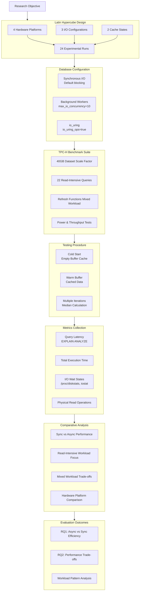

```mermaid
flowchart TD
    A[Research Objective] --> B[Experimental Design]
    
    subgraph B[Latin Hypercube Design]
        B1[4 Hardware Platforms]
        B2[3 I/O Configurations]
        B3[2 Cache States]
        B1 & B2 & B3 --> B4[24 Experimental Runs]
    end
    
    B4 --> C[PostgreSQL 18 Setup]
    
    subgraph C[Database Configuration]
        C1[Synchronous I/O<br/>Default blocking]
        C2[Background Workers<br/>max_io_concurrency=10]
        C3[io_uring<br/>io_uring_ops=true]
    end
    
    C --> D[Benchmark Implementation]
    
    subgraph D[TPC-H Benchmark Suite]
        D1[40GB Dataset Scale Factor]
        D2[22 Read-Intensive Queries]
        D3[Refresh Functions Mixed Workload]
        D4[Power & Throughput Tests]
    end
    
    D --> E[Execution Protocol]
    
    subgraph E[Testing Procedure]
        E1[Cold Start<br/>Empty Buffer Cache]
        E2[Warm Buffer<br/>Cached Data]
        E3[Multiple Iterations<br/>Median Calculation]
    end
    
    E --> F[Data Collection]
    
    subgraph F[Metrics Collection]
        F1[Query Latency<br/>EXPLAIN ANALYZE]
        F2[Total Execution Time]
        F3[I/O Wait States<br/>/proc/diskstats, iostat]
        F4[Physical Read Operations]
    end
    
    F --> G[Performance Analysis]
    
    subgraph G[Comparative Analysis]
        G1[Sync vs Async Performance]
        G2[Read-Intensive Workload Focus]
        G3[Mixed Workload Trade-offs]
        G4[Hardware Platform Comparison]
    end
    
    G --> H[Research Questions Answered]
    
    subgraph H[Evaluation Outcomes]
        H1[RQ1: Async vs Sync Efficiency]
        H2[RQ2: Performance Trade-offs]
        H3[Workload Pattern Analysis]
    end
```