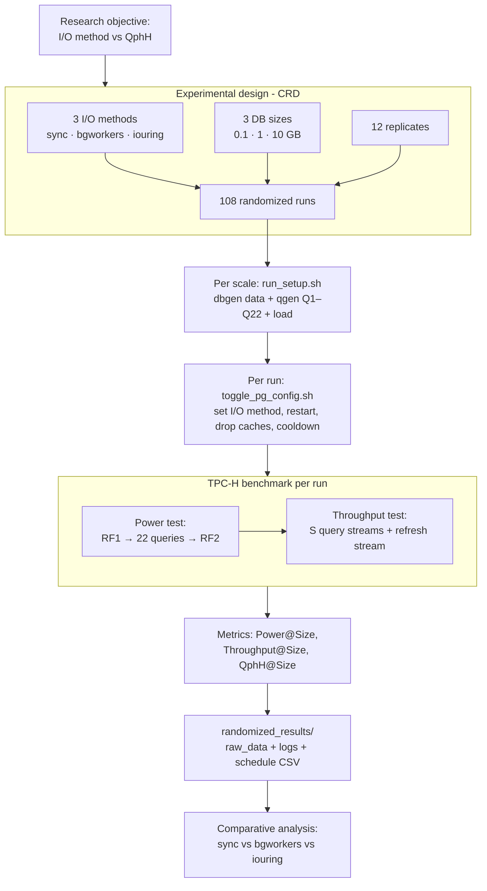

# Analysis of Asynchronous DB Read Operations

Research project benchmarking **PostgreSQL 18 I/O methods** with a TPC-H–derived workload.
The experiment compares three read-path configurations and measures their effect on the
TPC-H **QphH** metric across several database sizes.

- **Paper:** `paper/main.tex`
- **Experiment code:** `proof_of_concept/`
- **TPC-H compliance audit:** `proof_of_concept/readme/TPCH_COMPLIANCE.md`
- **Target runtime:** Linux VM with PostgreSQL 18.

## What is compared

| Factor | Levels |
|---|---|
| I/O method | `sync` (baseline) · `bgworkers` (parallel workers) · `iouring` (async io_uring) |
| Database size | 0.1 GB · 1 GB · 10 GB |
| Replicates | 12 per treatment |

**Design:** Completely Randomized Design (CRD). Full design = 3 × 3 × 12 = **108 runs**
(`generate_experimental_design.py`). The schedule is emitted to a CSV and executed in
randomized order. *(Note: a 40 GB size is planned but not part of the experiment for now.
A partial schedule may exist on disk when only part of the design has been run;
`run_full_experiment.sh` regenerates the full 108.)*

## Live experiment flow

```
run_full_experiment.sh                         top-level orchestrator
 ├─ cleanup_tpch.sh                             drop previous DBs (per scale)
 ├─ run_setup.sh         (per scale factor)     build tpch-kit, dbgen data, qgen Q1–Q22, load
 ├─ generate_experimental_design.py             emit randomized CRD schedule CSV (108 runs)
 └─ run_randomized_experiment.sh                read CSV; for each run:
      ├─ toggle_pg_config.sh <io_method>        rewrite postgresql.conf + restart PostgreSQL
      ├─ clear caches / restart / cooldown
      └─ run_tests.sh <io_method>               the actual TPC-H benchmark:
           ├─ execute_power_test                RF1 → 22 queries (stream 0) → RF2
           ├─ execute_throughput_test           S parallel query streams + parallel refresh stream
           └─ calculate_qphh                    Power, Throughput, QphH@Size per run
```

Results are written under `proof_of_concept/randomized_results/` (`raw_data/`, `logs/`,
the updated schedule CSV, and a final report). See `proof_of_concept/README.md` for how to
run setup and `proof_of_concept/commands-to-start-project.txt` for the exact command sequence.



## Repository layout

| Path | Purpose |
|---|---|
| `paper/` | LaTeX source of the paper (out of scope for code changes) |
| `proof_of_concept/` | Experiment scripts, TPC-H queries, results |
| `proof_of_concept/tpch_queries/` | qgen Q1–Q22 + refresh functions |
| `proof_of_concept/legacy/` | Archived/superseded scripts (not part of the live flow) |
| `drawings/` | Figure-generation scripts for the paper |
