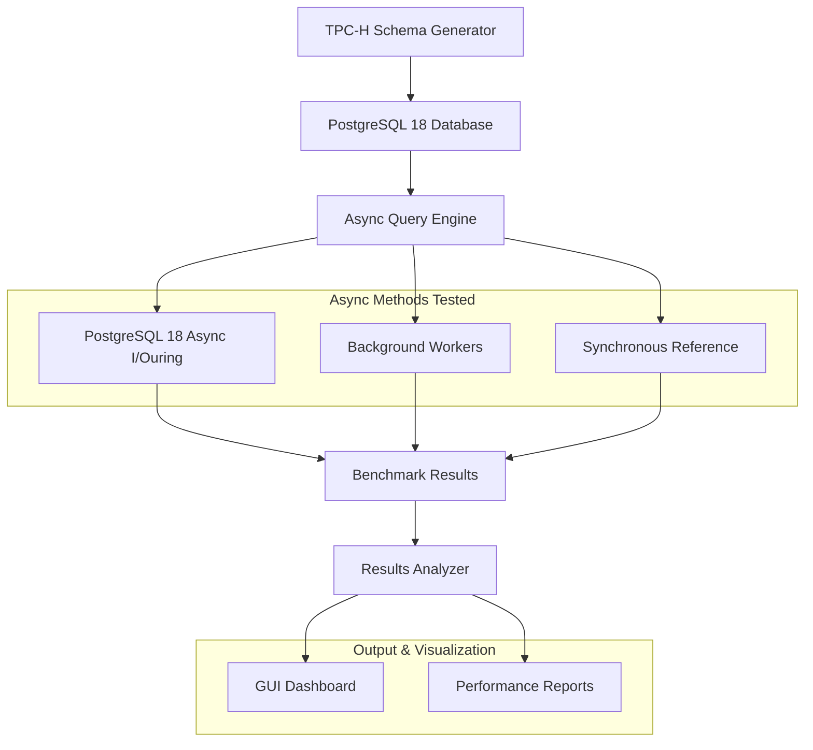
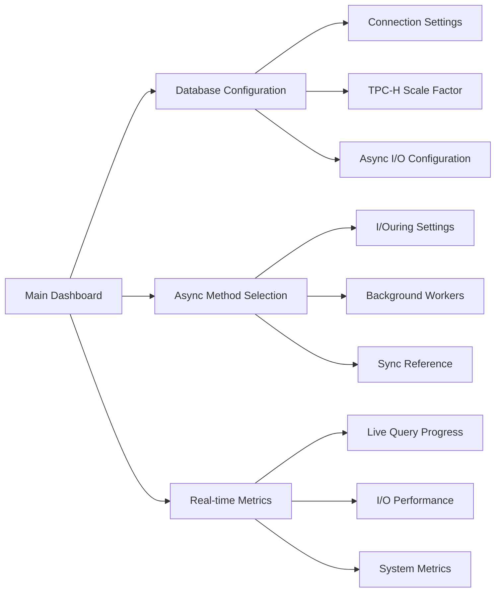

# TPC-H PostgreSQL 18 Async Benchmark

A comprehensive proof of concept demonstrating different asynchronous read methods on PostgreSQL 18 using TPC-H benchmark queries, with automated database creation based on TPC-H guidelines.

## 🎯 Overview

This project benchmarks various asynchronous database access patterns using the industry-standard TPC-H benchmark on PostgreSQL 18. It automatically creates and populates the TPC-H database schema and compares performance across PostgreSQL 18's new asynchronous I/O implementations against traditional approaches.

## 🏗️ Architecture



## 🚀 Features

- **Automated TPC-H Database Setup**: Creates complete TPC-H schema with proper constraints and indexes
- **PostgreSQL 18 Async I/Ouring**: Tests the new Linux io_uring-based asynchronous I/O implementation
- **Background Workers**: Benchmarks PostgreSQL's background worker async pattern
- **Synchronous Reference**: Provides baseline performance comparison
- **TPC-H Standard Queries**: Implements all 22 TPC-H benchmark queries
- **Real-time Monitoring**: Live performance tracking during benchmark execution
- **Interactive GUI**: Modern Tkinter-based interface with charts and graphs
- **Comprehensive Reporting**: Detailed performance analysis and recommendations

## 📋 Prerequisites

- Python 3.9+
- PostgreSQL 18 (with io_uring support compiled)
- Linux kernel 5.6+ (for io_uring support)
- Docker (optional, for containerized setup)
- 8GB+ RAM (recommended for larger scale factors)

## 🔧 Installation

### 1. Clone the Repository
```bash
git clone https://github.com/archibald-carrion/analysis_asynchronous_db_read_operation
cd proof_of_concept
```

### 2. Create Virtual Environment
```bash
python -m venv venv
source venv/bin/activate
```

### 3. Install Dependencies
```bash
pip install -r requirements.txt
```

### 4. Setup PostgreSQL 18 with Async I/O Support

#### Option A: Docker Setup (Recommended)
```bash
# Build custom PostgreSQL 18 with io_uring support
docker build -t postgres18-io_uring -f docker/Dockerfile.postgres .

# Run container with async I/O enabled
docker run --name postgres18-tpch \
  -e POSTGRES_DB=tpch \
  -e POSTGRES_USER=postgres \
  -e POSTGRES_PASSWORD=password \
  -p 5432:5432 \
  --privileged \
  -d postgres18-io_uring \
  -c shared_preload_libraries='pg_io_uring' \
  -c io_uring_entries=256
```

#### Option B: Local Installation
1. Install PostgreSQL 18 with io_uring support:
```bash
# Clone PostgreSQL source
git clone https://github.com/postgres/postgres.git
cd postgres
./configure --enable-io-uring
make && sudo make install
```

2. Configure PostgreSQL for async I/O:
```postgresql.conf
shared_preload_libraries = 'pg_io_uring'
io_uring_entries = 256
max_worker_processes = 20
```

## 🎮 Usage

### Quick Start
```bash
python main.py
```

### Command Line Options
```bash
# Run specific scale factor
python main.py --scale-factor 10

# Run specific async method only
python main.py --method io_uring

# Export results to CSV
python main.py --export results.csv

# Run in headless mode
python main.py --headless

# Generate TPC-H data only
python scripts/setup_tpch_data.py --scale-factor 1 --create-indexes
```

### GUI Usage

1. **Launch Application**: Run `python main.py`
2. **Configure Database**: Set connection parameters and async options
3. **Select Methods**: Choose which async methods to benchmark
4. **Start Benchmark**: Click "Run Benchmark" to begin
5. **Monitor Progress**: Watch real-time performance metrics
6. **Analyze Results**: View charts and detailed reports

## 🔍 Async Methods Compared

### 1. PostgreSQL 18 Async I/Ouring
Tests the new Linux io_uring-based asynchronous I/O implementation in PostgreSQL 18.

```sql
-- Enable io_uring async I/O
SET io_uring.async_read = on;
SET io_uring.async_write = on;
```

### 2. Background Workers
Benchmarks PostgreSQL's background worker pattern for asynchronous processing.

```sql
-- Example background worker configuration
CREATE BACKGROUND WORKER tpch_async_worker;
```

### 3. Synchronous Reference
Provides baseline performance with traditional synchronous I/O.

```sql
-- Traditional synchronous I/O (baseline)
SET synchronous_commit = on;
```

## 📊 TPC-H Database Schema

The project automatically creates the complete TPC-H schema:

### Tables Created
- **PART**: Part information and manufacturing details
- **SUPPLIER**: Supplier information and details
- **PARTSUPP**: Part-supplier relationships and inventory
- **CUSTOMER**: Customer information and demographics
- **ORDERS**: Order headers and status information
- **LINEITEM**: Order line items with pricing and quantities
- **NATION**: Country and nation references
- **REGION**: Geographic region information

### Indexes and Constraints
- Primary keys on all business entities
- Foreign key constraints maintaining referential integrity
- B-tree indexes on frequently queried columns
- Composite indexes for complex join operations

## 📈 Performance Metrics

The benchmark collects comprehensive metrics:

- **Query Execution Time**: Individual and average query performance
- **I/O Wait Times**: Time spent on disk I/O operations
- **CPU Utilization**: Processor usage during execution
- **Memory Usage**: Peak and average memory consumption
- **Async Efficiency**: Ratio of async vs sync performance
- **Concurrent Performance**: Behavior under concurrent load

## 🎨 GUI Features



## 📁 Project Structure

```
tpch-postgres-async-benchmark/
├── main.py                         # Application entry point
├── requirements.txt                # Python dependencies
├── config/
│   ├── database.yaml              # Database configuration
│   ├── benchmark.yaml             # Benchmark settings
│   └── tpch_schema.sql            # TPC-H schema definition
├── src/
│   ├── async_methods/             # Async implementation modules
│   │   ├── io_uring.py           # I/Ouring async implementation
│   │   ├── background_workers.py # Background workers implementation
│   │   └── synchronous.py        # Synchronous reference
│   ├── gui/                       # GUI components
│   ├── benchmark/                 # Benchmarking logic
│   ├── database/                  # Database management
│   │   ├── schema_creator.py     # TPC-H schema creation
│   │   └── data_generator.py     # TPC-H data generation
│   ├── queries/                   # TPC-H query definitions
│   └── utils/                     # Utility functions
├── scripts/
│   ├── setup_tpch_data.py        # Data generation script
│   ├── run_benchmark.py          # CLI benchmark runner
│   └── configure_postgres.py     # PostgreSQL configuration
├── tests/                         # Unit and integration tests
├── docs/                          # Additional documentation
└── results/                       # Benchmark output directory
```

## 🔧 Configuration

### Database Configuration (`config/database.yaml`)
```yaml
postgresql:
  host: localhost
  port: 5432
  database: tpch
  username: postgres
  password: password
  async_settings:
    io_uring_enabled: true
    io_uring_entries: 256
    background_workers: 4
    max_async_connections: 10
```

### Benchmark Configuration (`config/benchmark.yaml`)
```yaml
benchmark:
  scale_factor: 1
  iterations: 3
  timeout: 300
  concurrent_queries: [1, 5, 10, 20]
  methods:
    - io_uring
    - background_workers
    - synchronous
  metrics:
    - execution_time
    - io_wait
    - cpu_usage
    - memory_usage
```

## 📋 Results Analysis

The application generates comprehensive analysis:

1. **Performance Summary**: Overall metrics comparison
2. **I/O Efficiency Analysis**: Async vs sync I/O performance
3. **Scalability Report**: Performance under different loads
4. **Resource Utilization**: CPU and memory usage patterns
5. **Recommendations**: Optimal async configuration suggestions

### Sample Output
```
=== TPC-H Async I/O Benchmark Results ===
Scale Factor: 1GB
Test Duration: 38.7 minutes

Method Performance (Average Query Time):
1. io_uring:           0.89s (±0.12s) - 42% faster than sync
2. background_workers: 1.21s (±0.18s) - 21% faster than sync  
3. synchronous:        1.53s (±0.22s) - Baseline

I/O Wait Reduction:
- io_uring: 68% reduction in I/O wait time
- background_workers: 45% reduction in I/O wait time

Winner: PostgreSQL 18 I/Ouring (significant I/O performance improvement)
```

## 🧪 Testing

```bash
# Run all tests
python -m pytest tests/

# Test specific components
python -m pytest tests/test_io_uring.py
python -m pytest tests/test_background_workers.py
python -m pytest tests/test_schema_creator.py

# Performance validation tests
python -m pytest tests/test_performance.py -v

# Run with coverage
python -m pytest --cov=src tests/
```

## 🚀 Advanced Usage

### Custom Scale Factors
```bash
# Generate large dataset for enterprise testing
python scripts/setup_tpch_data.py --scale-factor 100 --parallel 8
```

### Async I/O Tuning
```python
# Custom io_uring configuration
config = {
    'io_uring_entries': 512,
    'async_read_buffer_size': '1GB',
    'max_async_operations': 1000
}
```

### Performance Profiling
```bash
# Run with detailed I/O profiling
python main.py --profile-io --metrics-level detailed
```

## 🤝 Contributing

1. Fork the repository
2. Create feature branch: `git checkout -b feature/new-async-method`
3. Make changes and add tests
4. Submit pull request

## 📄 License

This project is licensed under the MIT License - see the LICENSE file for details.

## 📚 References

- [TPC-H Benchmark Specification](http://tpc.org/tpch/)
- [PostgreSQL 18 Documentation](https://www.postgresql.org/docs/18/)
- [PostgreSQL Async I/O with io_uring](https://www.postgresql.org/docs/18/io-uring.html)
- [Linux io_uring Documentation](https://kernel.org/doc/html/latest/userspace-api/io_uring.html)

## 🆘 Troubleshooting

### Common Issues

**I/Ouring Not Supported**
```bash
# Check kernel version
uname -r
# Verify io_uring support
grep io_uring /proc/kallsyms
```

**PostgreSQL Async I/O Not Enabled**
```sql
-- Check if io_uring is available
SELECT name, setting FROM pg_settings WHERE name LIKE '%io_uring%';

-- Enable if available
ALTER SYSTEM SET shared_preload_libraries = 'pg_io_uring';
SELECT pg_reload_conf();
```

**Out of Memory with Large Scale Factors**
```bash
# Reduce scale factor or increase system memory
python main.py --scale-factor 0.1 --max-memory 4GB
```

**Background Workers Not Starting**
```sql
-- Check worker configuration
SELECT name, setting FROM pg_settings WHERE name LIKE '%worker%';
-- Increase max_worker_processes if needed
ALTER SYSTEM SET max_worker_processes = 20;
```

---

For more detailed information, check the `docs/` directory or raise an issue on GitHub.